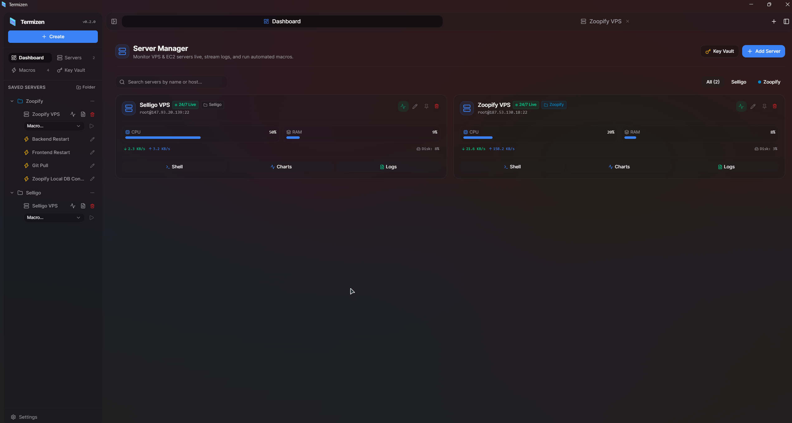
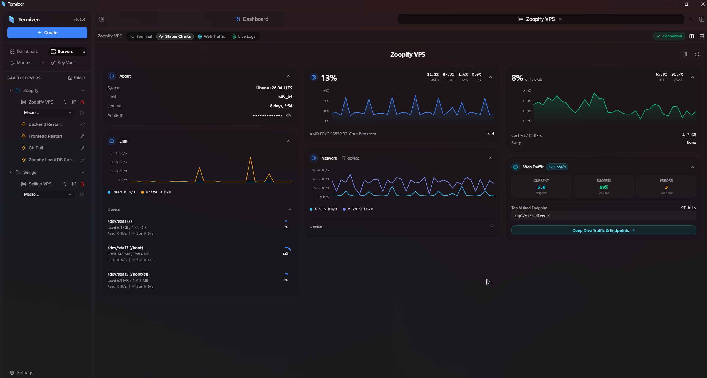
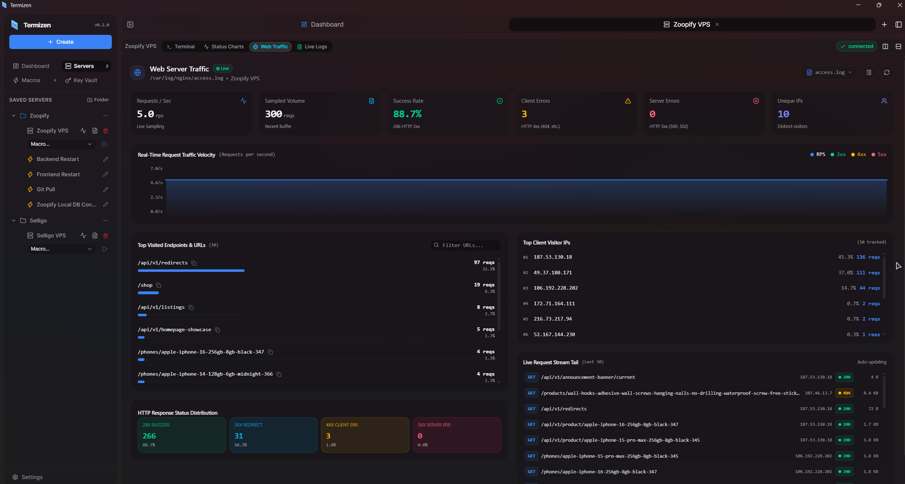
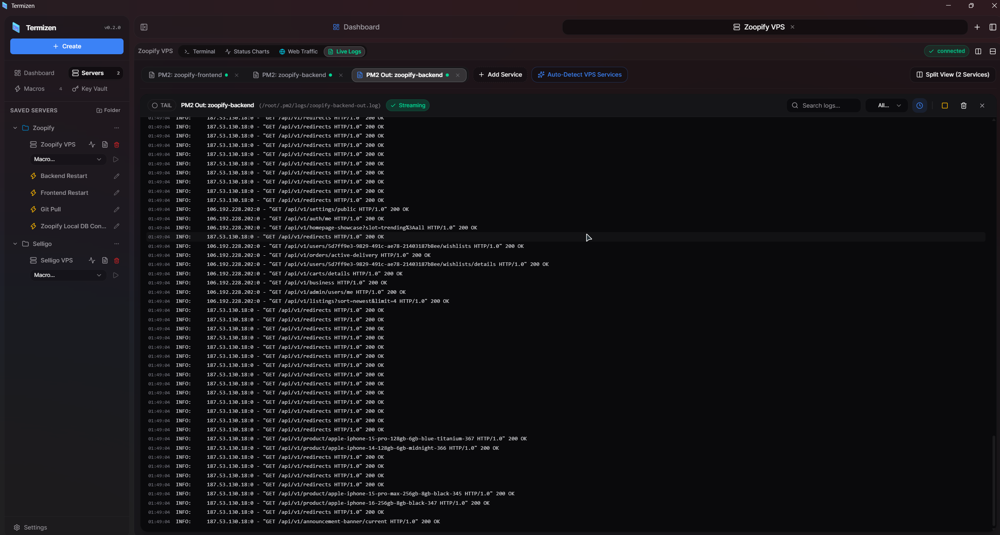
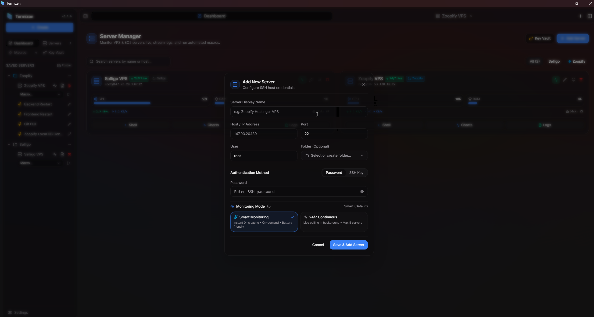
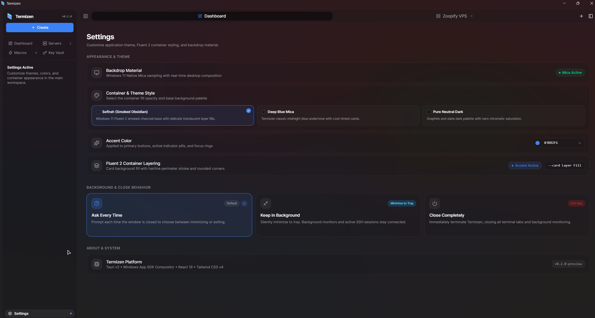

  
  <h1>Termizen</h1>
  <h3>High-performance terminal multiplexer, SSH vault, and real-time VPS operations cockpit for Windows.</h3>
  

    
    
    
    
     
    
    
    
    
     
    
    
  

Termizen is an open-source, local-first terminal multiplexer, secure SSH vault, and real-time server command center crafted natively for Windows. It combines multi-pane terminal emulation, live hardware telemetry, web traffic analysis, and multi-service log streaming into a single, GPU-accelerated Windows 11 Mica interface.

All connection profiles, private keys, and server secrets are encrypted on-device using authenticated AES-256-GCM, with zero telemetry or cloud dependencies.

- Repository: [https://github.com/shuaib-07/termizen](https://github.com/shuaib-07/termizen)
- Releases: [https://github.com/shuaib-07/termizen/releases](https://github.com/shuaib-07/termizen/releases)
- Issues: [https://github.com/shuaib-07/termizen/issues](https://github.com/shuaib-07/termizen/issues)
- License: [LICENSE](LICENSE)

## Download Termizen

Open the [latest release page](https://github.com/shuaib-07/termizen/releases/latest), then download the package that matches your system:

| Platform | Package | Note |
| :-- | :-- | :-- |
| **Windows 10/11 (x64 Installer)** | `Termizen_0.1.0_x64-setup.exe` | Guided NSIS installer with desktop and Start Menu shortcuts |
| **Windows 10/11 (x64 MSI)** | `Termizen_0.1.0_x64_en-US.msi` | Windows Installer package for enterprise deployment |

Unsigned binary — if Windows SmartScreen displays a warning on first launch, click **More info** then **Run anyway**.

## Screenshots

  
  
  
  
  
  

## Why Termizen

- **Built for freelance workflows**: As a freelance developer maintaining web applications, databases, and VPS infrastructure for clients and personal projects, existing tools required constant context-switching between PuTTY/PowerShell, web hosting panels, and manual terminal log tails. Termizen puts live hardware stats, real-time log tails, and instant SSH access in a single, fast desktop application. Automation features are actively planned to streamline ongoing maintenance.
- **Modern Windows 11 Mica design & fluid animations**: Native OS-composited DWM Mica dark material, rounded-corner container hierarchy, zero artificial glow, and physics-based Framer Motion spring interactions.
- **Agentless live monitoring**: CPU per-core distribution, memory allocation, disk partitions, and network throughput streamed directly over SSH without installing background agents on remote servers.
- **Hardware-encrypted Key Vault**: Local SQLite storage protected with authenticated AES-256-GCM encryption for private keys and connection secrets.
- **Local-first and private**: No forced cloud account, no telemetry, and zero tracking.

## Features

- **Multi-pane terminal multiplexer** with horizontal and vertical 50/50 splits, xterm.js canvas rendering, and portable-pty.
- **Real-time server telemetry** graphing CPU cores, memory/swap, disk partition usage, and network I/O.
- **Web traffic analytics** parsing Nginx and Apache access logs live with status code breakdowns, top endpoints, request velocity, and client IPs.
- **Service log streaming** with auto-discovery for PM2 apps, Docker containers, and systemd services with ANSI color rendering.
- **Macro automation** supporting PTY and background exec scripts with halt-on-error policies and per-profile scoping.
- **Theme and accent personalization** featuring Windows 11 Mica material and custom accent color selection.

## Inspiration & Acknowledgements

Termizen draws inspiration from [lollipopkit/flutter_server_box](https://github.com/lollipopkit/flutter_server_box) (ServerBox) for modern server operations, bringing that unified vision natively to Windows with a modern Mica desktop design.

## License

This project is open-source under the [MIT License](LICENSE).
